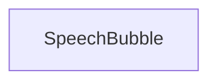

# SpeechBubble

## Description

Base class for implementing custom speech bubble types.

Some guides for SVG formatting:
- https://www.w3schools.com/graphics/svg_intro.asp
- https://developer.mozilla.org/en-US/docs/Web/SVG/Tutorials/SVG_from_scratch

## Attributes
- `_width` float
- `_height` float
- `_tailAnglePosition` float
- `_tailWidth` float
- `_tailLength` float

## Methods

#### `clear()`
    resets all attributes to zero

#### `getPreview()`
    not implemented

#### `height()`
    returns the height of the bubble

#### `radius()`
    not implemented

#### `radiusDeriv()`
    not implemented

#### `radiusXDeriv()`
    not implemented

#### `radiusXDerivNorm()`
    not implemented

#### `radiusYDeriv()`
    not implemented

#### `radiusYDerivNorm()`
    not implemented

#### `setHeight()`
    sets the height of the bubble

#### `setTailAnglePosition()`
    sets the angle position of the bubble tail

#### `setTailLength()`
    sets the length of the bubble tail

#### `setTailWidth()`
    sets the width of the bubble tail

#### `setup()`
    a method to initialize all the attributes at once

#### `setWidth()`
    sets the width of the bubble

#### `tailAnglePosition()`
    returns the angle position of the bubble tail

#### `tailLength()`
    returns the length of the bubble tail

#### `tailWidth()`
    returns the width of the bubble tail

#### `width()`
    returns the width of the bubble