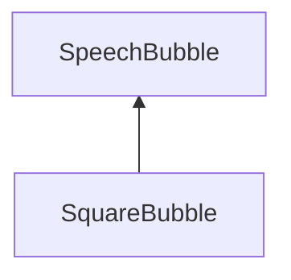

# SquareBubble

## Description

Base class for implementing custom speech bubble types that follow a square shape

Some guides for SVG formatting:
- https://www.w3schools.com/graphics/svg_intro.asp
- https://developer.mozilla.org/en-US/docs/Web/SVG/Tutorials/SVG_from_scratch

## Attributes

Attributes inherited from SpeechBubble

- `_width` float
- `_height` float
- `_tailAnglePosition` float
- `_tailWidth` float
- `_tailLength` float

## Methods

#### `radius()`
    square bubble does not implement radius, instead it implements radiusX() and radiusY()

#### `radiusDeriv()`
    returns the derivative of the radius of the square bubble at a given angle

#### `radiusDerivVec()`
    not implemented

#### `radiusX()`
    returns the x-position of a point on the square bubble at a given angle

#### `radiusXDeriv()`
    returns the derivative of the square bubble in the x-direction at a given angle

#### `radiusXDerivNorm()`
    returns the normalized derivative of the square bubble in the x-direction at a given angle

#### `radiusY()`
    returns the x-position of a point on the square bubble at a given angle

#### `radiusYDeriv()`
    returns the derivative of the square bubble in the y-direction at a given angle

#### `radiusYDerivNorm()`
    returns the normalized derivative of the square bubble in the y-direction at a given angle

#### `radiusDerivNormVec()`
    returns the normalized derivative vector at a point on the ellipse given an angle

#### `SquareBubblePoint()`
    returns a Point on the square bubble

Methods inherited from SpeechBubble

#### `clear()`
    resets all attributes to zero

#### `getPreview()`
    not implemented

#### `height()`
    returns the height of the bubble

#### `radius()`
    not implemented

#### `radiusDeriv()`
    not implemented

#### `radiusXDeriv()`
    not implemented

#### `radiusXDerivNorm()`
    not implemented

#### `radiusYDeriv()`
    not implemented

#### `radiusYDerivNorm()`
    not implemented

#### `setHeight()`
    sets the height of the bubble

#### `setTailAnglePosition()`
    sets the angle position of the bubble tail

#### `setTailLength()`
    sets the length of the bubble tail

#### `setTailWidth()`
    sets the width of the bubble tail

#### `setup()`
    a method to initialize all the attributes at once

#### `setWidth()`
    sets the width of the bubble

#### `tailAnglePosition()`
    returns the angle position of the bubble tail

#### `tailLength()`
    returns the length of the bubble tail

#### `tailWidth()`
    returns the width of the bubble tail

#### `width()`
    returns the width of the bubble

